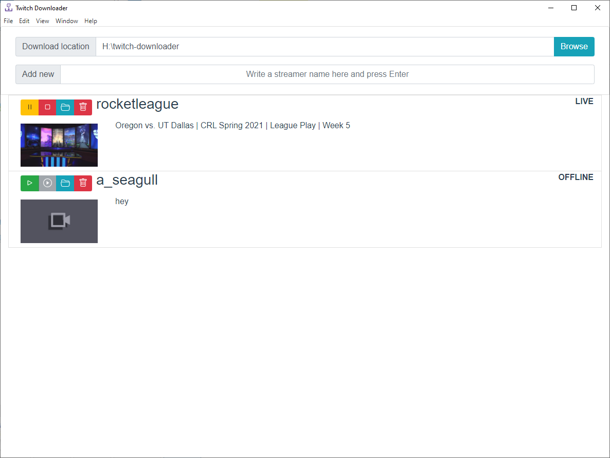

# Twitch Downloader

## About this project

I just don't really like twitch's interface. It's slow to load, and scrubbing is terrible. So I made this app to automatically download live streams from twitch. This allows the user to watch streams using any video player (like VLC), go back to watch something again, and also saves the video for watching later.

## Installation

Go to the [last release page](https://github.com/Seblor/twitch-downloader/releases/latest), then download and run the setup file corresponding to your operating system. For now, only Windows is available.

## Screenshot

